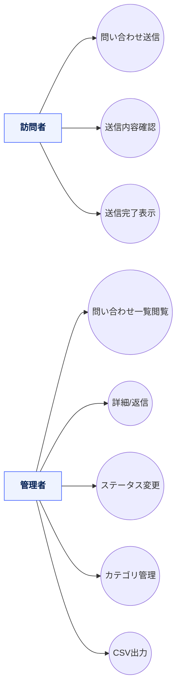
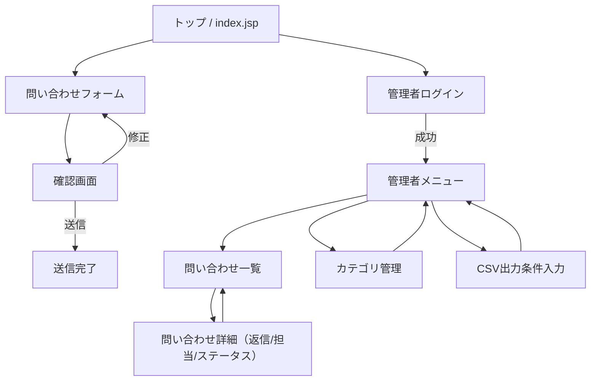
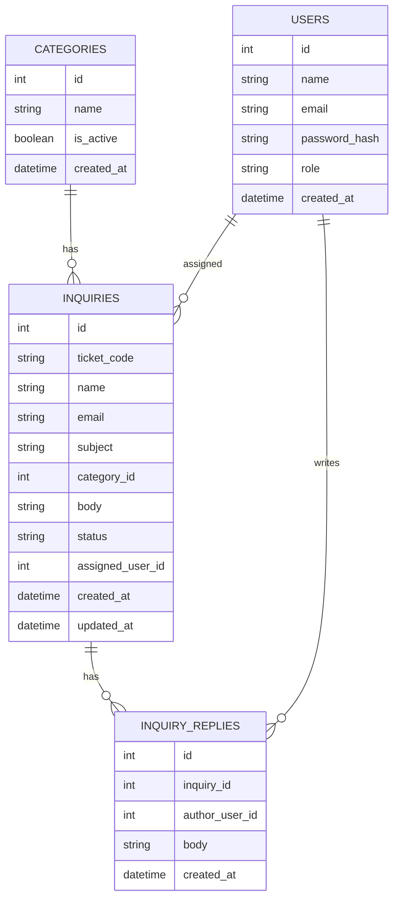
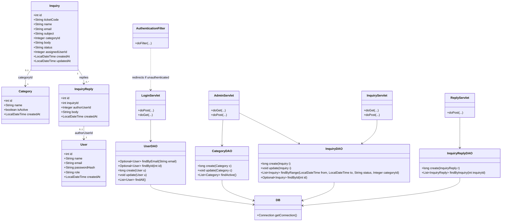

# InquiryApp（前期版）— 問い合わせ管理ミニシステム

**お問い合わせ送信（フォーム）**、**管理者による対応（閲覧／返信／ステータス管理）**、**カテゴリ管理**、**CSV出力**を行う学習用 Web アプリです。  
Jakarta Servlet (Servlet 5) + JSP をベースに、Eclipse での学習や演習に最適化したテンプレート。

> **注**: 本 README はテンプレートです。実装クラス名・パス・DB 名などはプロジェクトに合わせて調整してください。

---

## 目次

- [機能](#機能)
- [アーキテクチャ](#アーキテクチャ)
- [ディレクトリ構成](#ディレクトリ構成)
- [セットアップと起動](#セットアップと起動)
- [ユーザーストーリー](#ユーザーストーリー)
- [ユースケース図（Mermaid）](#ユースケース図mermaid)
- [画面遷移図（Mermaid）](#画面遷移図mermaid)
- [ER 図（Mermaid）](#er-図mermaid)
- [クラス図（Mermaid）](#クラス図mermaid)
- [クラス設計表（責務・主要メソッド）](#クラス設計表責務主要メソッド)
- [用語辞書](#用語辞書)
- [ライセンス](#ライセンス)

---

## 機能

**訪問者（未ログイン）**
- お問い合わせの新規送信（氏名／メール／件名／カテゴリ／本文）
- 送信内容の確認画面・完了画面

**管理者**
- 問い合わせ一覧（期間／カテゴリ／ステータスでフィルタ・ソート）
- 問い合わせ詳細の閲覧・返信、ステータス変更（NEW → IN_PROGRESS → RESOLVED/CLOSED）
- カテゴリの追加・無効化
- CSV 出力（期間・カテゴリ・ステータスで抽出）

---

## アーキテクチャ

- **言語／ランタイム**: Java（Jakarta Servlet 5 互換）
- **ビュー**: JSP + JSTL + CSS
- **DB**: PostgreSQL（サンプル SQL 付）
- **構成**: Model（Entity） / DAO / Servlet（Controller） / Filter（Auth） / JSP（View）

---

## ディレクトリ構成

> 代表的な構成（Eclipse Dynamic Web Project / `src/main` 配下）

```text
src/
└─ main
   ├─ java/
   │  └─ com/example/inquiry/
   │     ├─ entity/
   │     │  ├─ User.java
   │     │  ├─ Category.java
   │     │  ├─ Inquiry.java
   │     │  └─ InquiryReply.java
   │     ├─ dao/
   │     │  ├─ UserDAO.java
   │     │  ├─ CategoryDAO.java
   │     │  ├─ InquiryDAO.java
   │     │  └─ InquiryReplyDAO.java
   │     ├─ servlet/
   │     │  ├─ LoginServlet.java
   │     │  ├─ InquiryServlet.java
   │     │  ├─ AdminServlet.java
   │     │  └─ ReplyServlet.java
   │     ├─ filter/
   │     │  └─ AuthenticationFilter.java
   │     └─ util/
   │        └─ DB.java
   └─ webapp/
      ├─ WEB-INF/
      │  ├─ web.xml
      │  └─ views/
      │     ├─ inquiry_form.jsp
      │     ├─ inquiry_confirm.jsp
      │     ├─ inquiry_thanks.jsp
      │     ├─ login.jsp
      │     ├─ menu_admin.jsp
      │     ├─ inquiry_list.jsp
      │     ├─ inquiry_detail.jsp
      │     └─ categories_admin.jsp
      ├─ style.css
      └─ index.jsp
```

## セットアップと起動
1) 事前準備
 - Java 17 以上（推奨）
 - Tomcat 10.1+ または Jetty 11+（Jakarta 名前空間対応）
 - PostgreSQL 15+（サンプルでは inquiry_db を使用）

2) DB 初期化（サンプル）
```text
-- DB 作成
CREATE DATABASE inquiry_db;

-- アプリ用ユーザー
CREATE USER inquiry_app WITH PASSWORD 'password';
GRANT ALL PRIVILEGES ON DATABASE inquiry_db TO inquiry_app;

-- ステータス型
CREATE TYPE inquiry_status AS ENUM ('NEW','IN_PROGRESS','RESOLVED','CLOSED');

-- スキーマ
CREATE TABLE users (
  id SERIAL PRIMARY KEY,
  name TEXT NOT NULL,
  email TEXT UNIQUE NOT NULL,
  password_hash TEXT NOT NULL,
  role TEXT NOT NULL DEFAULT 'ADMIN',
  created_at TIMESTAMP NOT NULL DEFAULT NOW()
);

CREATE TABLE categories (
  id SERIAL PRIMARY KEY,
  name TEXT UNIQUE NOT NULL,
  is_active BOOLEAN NOT NULL DEFAULT TRUE,
  created_at TIMESTAMP NOT NULL DEFAULT NOW()
);

CREATE TABLE inquiries (
  id SERIAL PRIMARY KEY,
  ticket_code TEXT UNIQUE,
  name TEXT NOT NULL,
  email TEXT NOT NULL,
  subject TEXT NOT NULL,
  category_id INTEGER REFERENCES categories(id),
  body TEXT NOT NULL,
  status inquiry_status NOT NULL DEFAULT 'NEW',
  assigned_user_id INTEGER REFERENCES users(id),
  created_at TIMESTAMP NOT NULL DEFAULT NOW(),
  updated_at TIMESTAMP NOT NULL DEFAULT NOW()
);

CREATE TABLE inquiry_replies (
  id SERIAL PRIMARY KEY,
  inquiry_id INTEGER NOT NULL REFERENCES inquiries(id) ON DELETE CASCADE,
  author_user_id INTEGER REFERENCES users(id),
  body TEXT NOT NULL,
  created_at TIMESTAMP NOT NULL DEFAULT NOW()
);

-- 管理者の作成例（パスワードはハッシュ化して入れる想定）
INSERT INTO users (name, email, password_hash, role)
VALUES ('管理者', 'admin@example.com', '{BCRYPT_HASH_HERE}', 'ADMIN');

-- カテゴリのサンプル
INSERT INTO categories (name) VALUES ('一般'), ('技術サポート'), ('請求'), ('その他');
```

3) 接続設定
DB.java（または環境変数）で接続情報を設定:
```text
JDBC_URL=jdbc:postgresql://localhost:5432/inquiry_db
DB_USER=inquiry_app
DB_PASSWORD=password
```

4) 実行
Eclipse + Tomcat
プロジェクトを “Dynamic Web Project” としてインポート → Tomcat にデプロイ → http://localhost:8080/ へアクセス

Jetty（任意）
jetty-maven-plugin を設定済みなら:
```text
mvn jetty:run
# → http://localhost:8080/
```

## ユーザーストーリー
### 訪問者として、簡単なフォームで問い合わせを送り、送信前に内容確認し、送信後に受付完了を把握したい。

### 管理者として、新着問い合わせを素早く把握し、返信とステータス更新、カテゴリ運用、CSV出力まで行いたい。

## ユースケース図


## 画面遷移図


## ER 図


## クラス図


## クラス設計表（責務・主要メソッド）
| クラス                    | 役割（責務）                | 主要メソッド                             | 共同作業相手                                 |
| ---------------------- | --------------------- | ---------------------------------- | -------------------------------------- |
| `User`                 | 管理者アカウント情報            | getter/setter                      | `UserDAO`                              |
| `Category`             | 問い合わせカテゴリ             | getter/setter                      | `CategoryDAO`                          |
| `Inquiry`              | 問い合わせ本体               | getter/setter                      | `InquiryDAO`, `Category`               |
| `InquiryReply`         | 管理者返信                 | getter/setter                      | `InquiryReplyDAO`, `Inquiry`           |
| `UserDAO`              | `users` 永続化           | `findByEmail`, `create`, `findAll` | `DB`, `LoginServlet`                   |
| `CategoryDAO`          | `categories` 永続化      | `findActive`, `update`             | `DB`, `AdminServlet`                   |
| `InquiryDAO`           | `inquiries` 永続化       | `create`, `update`, `findByRange`  | `DB`, `InquiryServlet`, `AdminServlet` |
| `InquiryReplyDAO`      | `inquiry_replies` 永続化 | `create`, `findByInquiry`          | `DB`, `ReplyServlet`, `AdminServlet`   |
| `DB`                   | JDBC 接続提供             | `getConnection`                    | すべての DAO                               |
| `AuthenticationFilter` | 未ログインアクセスの遮断          | `doFilter`                         | すべての Servlet                           |
| `LoginServlet`         | 認証・セッション開始            | `doPost`, `doGet`                  | `UserDAO`, `AuthenticationFilter`      |
| `InquiryServlet`       | 問い合わせ送信フロー            | `doGet`, `doPost`                  | `InquiryDAO`                           |
| `AdminServlet`         | 管理者機能（一覧/詳細/カテゴリ/CSV） | `doGet`, `doPost`                  | `InquiryDAO`, `CategoryDAO`            |
| `ReplyServlet`         | 返信投稿                  | `doPost`                           | `InquiryReplyDAO`                      |


## 用語辞書
| 用語                      | 意味                                            |
| ----------------------- | --------------------------------------------- |
| 問い合わせ（Inquiry）          | 訪問者が送信する問い合わせデータ                              |
| 返信（Reply）               | 管理者による回答メッセージ                                 |
| カテゴリ（Category）          | 問い合わせの分類                                      |
| ステータス（status）           | `NEW` / `IN_PROGRESS` / `RESOLVED` / `CLOSED` |
| 担当者（assigned\_user\_id） | 問い合わせに割り当てられた管理者ユーザー                          |


## ライセンス
教育目的のサンプル。必要に応じてプロジェクト方針に合わせて追記してください。
```text
::contentReference[oaicite:0]{index=0}
```
